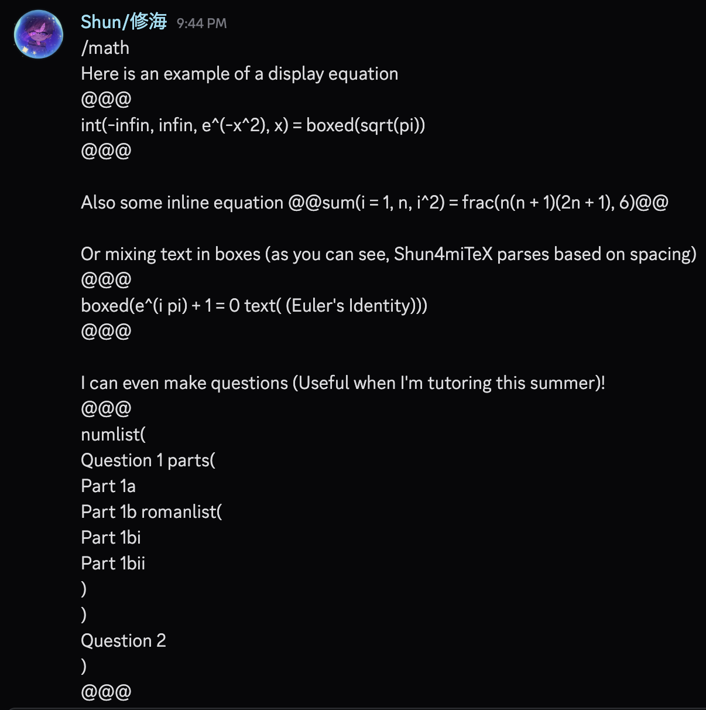
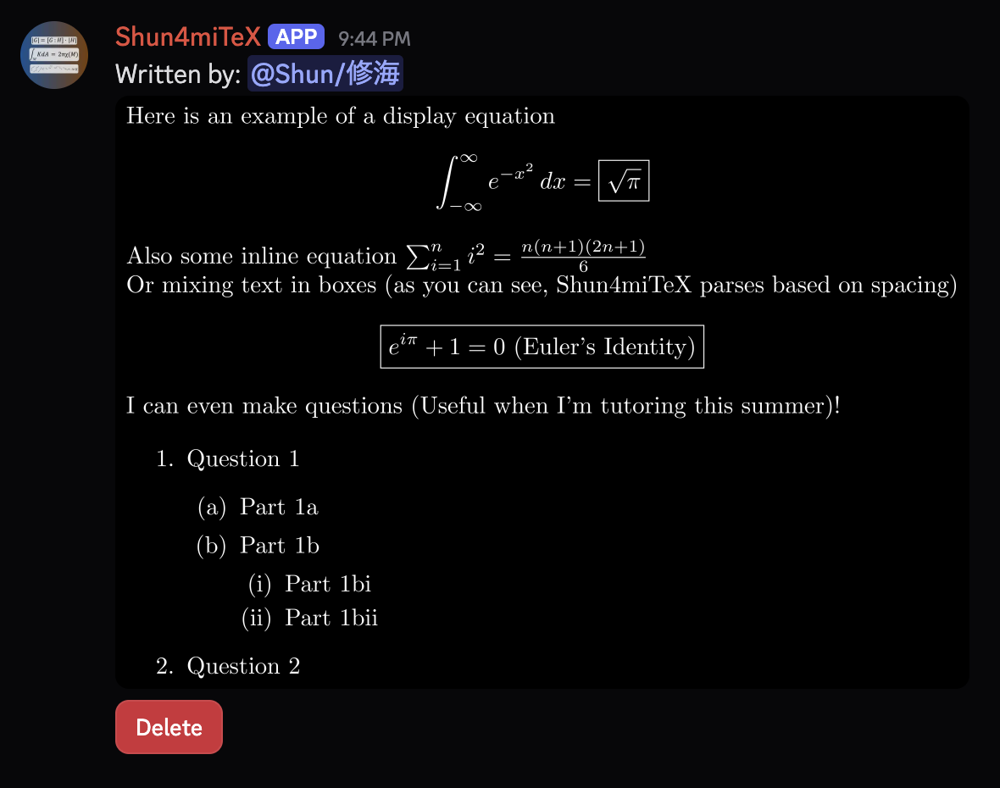

# Shun4miTeX
Shun's Discord bot for rendering LaTeX and natural math notation into formal TeX-like images. It also includes a basic scientific calculator for convenience. Like most of Shun's projects, it's written in C++.

It's canonically pronounced as "Shunami TeX" or "Tsunami TeX".

Currently, the core renderer works from the command line: it writes a temporary LaTeX file, renders it inside a Dockerized TeX Live environment, converts the result to PNG (with white text on a black background), and returns the generated image. Then, this backend process is wrapped via a Discord bot.

# Demo

Shun4miTeX can take a Discord message written in natural math notation and render it as a TeX-like image, like below with the input and output!



# Command Usage

The main supported commands are `/math` and `/tex`, which support natural math notation and LaTeX respectively. They can either be used via slash commands, or typed into a text message like so:
```text
/math
<natural math here>
```
or
```text
/tex
<TeX math here>
```

For more information about how to use natural math notation, please refer to [here](docs/Natural_Doc.md).

For more information about what kinds of calculations the scientific calculator supports, please refer to [here](docs/Calculator_Doc.md). It is accessed via typing in the `/calc` slash command.

# Invite Shun's Hosted Shun4miTeX Bot
Here is the [invite link](https://discord.com/oauth2/authorize?client_id=1516208270631632978) if you want to invite Shun's currently hosted instance of the Shun4miTeX bot into your server!

# Features

* [x] C++ CLI renderer
* [x] Dockerized LaTeX rendering
* [x] PNG output with dark background
* [x] Basic math packages and `tcolorbox` support including some other minimal shortcuts [I use](https://github.com/shun4midx/LaTeX-Template)
* [x] Discord bot message command
* [x] Slash command support
* [x] Natural math notation parser (Currently supports roughly high school and early college math)
* [x] Documented list of supported natural math notation

# Requirements

* Docker
* C++20 compiler
* TeX packages are installed inside the Docker image, so a local TeX Live installation is not required for rendering.

# Usage

## Clone the Repo
First, we clone this repo before proceeding
```bash
git clone https://github.com/shun4midx/Shun4miTeX
cd Shun4miTeX
```

## Build Docker Image

```bash
docker build -t shun4mitex-renderer .
```

## Hosting the Bot
1. Clone the DPP repo to build from source with CMake (If you don't have it, please check out how to install CMake):
```cmd
git clone https://github.com/brainboxdotcc/DPP
```

2. Create a `.env` file, and type in the following, but replace it with your relevant details without the <>:
```env
BOT_TOKEN=<Your bot token>
MESSAGE_PERMS=<Your username>,<Person 2 with message perms' username>,<etc>
BOT_USERNAME="<Your bot username including the discriminator>"
CONFLICTING_BOTS="<Any conflicting bot usernames including the discriminator>","<like this>"
```

3. Type the following CMake commands (Make sure to install `pkg-config` first if you don't have it):
```cmd
mkdir build && cd build
cmake ..
cmake --build . --target shun4mitex -j
./shun4mitex
```

And your bot should run properly, if given the correct perms!

# CLI Test Usage
## Build CLI Test

```bash
g++ -std=c++20 src/cli.cpp src/latex_render/latex_render.cpp -o cli
```

## CLI Test Usage

```bash
./cli 'This is a fraction $\frac{x^2+1}{x-3}$'
```

Example with a custom color box based off of [Shun's usually used minimal shortcuts](https://github.com/shun4midx/LaTeX-Template):

```bash
./cli '\pinkbox{Note}{Hello from Shun4miTeX}'
```

Generated render jobs are stored under `jobs/`.

# Notes

This project is still in early development. I plan to support more languages and also emojis and other unicode in the future. Additionally, I plan to support more natural notation. However, for preliminary usage, it should suffice.

For support, please contact me via [Email](mailto:shun4midx@gmail.com) or Discord at @shun4midx.

# Credit
DPP can be directly found via [this repo](https://github.com/brainboxdotcc/DPP), and is used for C++ Discord bot coding.